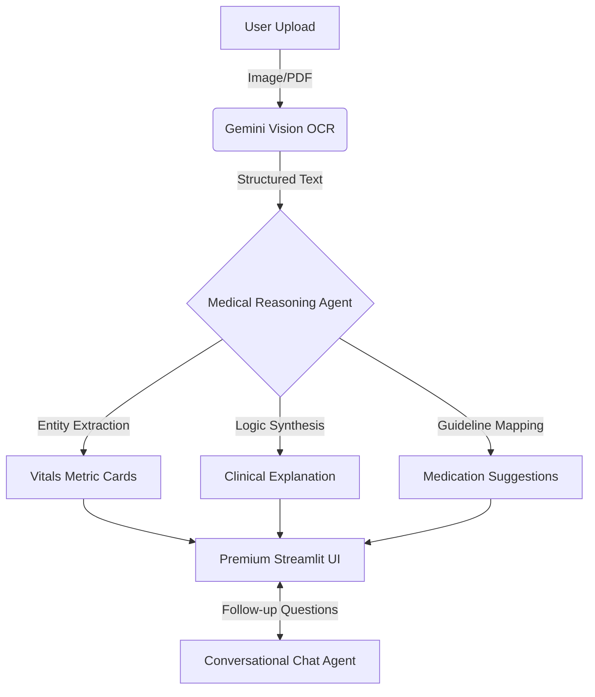

# 🩺 Medical AI: The Advanced Report Navigator  


> **"Transforming cryptic lab numbers into clear, conversational health guidance."**

Medical reports are often black boxes to everyone except doctors. **Medical AI** breaks that box. It's not just an analyzer; it's an **Agentic Medical Assistant** that sees your reports, understands your vitals, suggests management steps, and answers your deepest health questions in real-time.

---

## 🚀 Why This Project is "Mind-Boggling"

### 👁️ 1. Multi-Modal Vision Intelligence
Forget traditional OCR that breaks on blurry photos or skewed screenshots. We leverage **Gemini 1.5 Flash Vision** to "read" your reports like a human. It understands tables, detects units, and handles complex medical layouts with near-perfect precision from any photo or screenshot.

### 🧠 2. Deep Clinical Reasoning (Non-RAG)
While others rely on simple "find-and-replace" knowledge bases, this system uses **Advanced Clinical Reasoning**. It doesn't just see "Glucose: 140"; it understands why that might be high based on modern clinical standards and correlates multiple vitals to give you the "Why" behind your data.

### 💬 3. Interactive "Chat-With-Your-Body"
The analysis isn't a static PDF. It’s a **living conversation**. Ask the AI:
- *"What should I eat to lower my Cholesterol?"*
- *"Are these results normal for my age?"*
- *"What are the common side effects of the medications you mentioned?"*

### 💊 4. Predictive Management & Medications
The AI identifies abnormalities and immediately cross-references them with standard medical guidelines to suggest **potential medications, lifestyle changes, and dietary adjustments**—all while maintaining strict safety guardrails.

### 🛡️ 5. Privacy & Guardrails
- **PII Redaction**: Built-in support to redact patient names and sensitive identifiers.
- **Safety Chains**: Multi-layered prompts ensure the AI never makes a "diagnosis" but provides "educational associations," keeping the user safe and informed.

---

## 🎨 Professional UI Preview
- **Dynamic Metric Cards**: Visual flags for **High**, **Low**, and **Normal** vitals.
- **Glassmorphic Design**: A premium, dark-mode-ready interface that feels like a $1M health app.
- **Real-time Chat**: Seamlessly integrated chat interface for follow-up guidance.

---

## 🛠️ Architecture & Workflow



---

## 📂 Project Structure

```text
medical-rag-ai/
├── backend/
│   ├── api/                # API Endpoints (Upload, Analyze, Chat, Stream)
│   ├── models/             # Pydantic Data Schemas
│   ├── ocr/                # Gemini Vision AI OCR Engine
│   ├── prompts/            # Medical & Safety Prompt Templates
│   ├── rag/                # Core Agentic Logic (Clinical Chain)
│   ├── security/           # PII Redaction & Data Safety
│   ├── config.py           # Environment & Settings Loader
│   └── main.py             # FastAPI Application Root
├── frontend/
│   └── app.py              # Premium Streamlit UI & Chat Interface
├── knowledge_base/         # Local Medical Guidelines & Lab Ranges
├── .env                    # Secrets & API Configurations
├── requirements.txt        # Project Dependencies
└── README.md               # Technical Specification & Documentation
```

---


## ⚙️ Quick Start

### 1. Prerequisite
- Python 3.10+
- Google Gemini API Key

### 2. Installation
```powershell
# Clone the repo
git clone https://github.com/your-username/medical-ai.git
cd medical-ai

# Install dependencies
pip install -r requirements.txt
```

### 3. Environment Setup
Create a `.env` file:
```env
GOOGLE_API_KEY=your_gemini_key_here
LLM_MODEL=gemini-1.5-flash
APP_NAME="Medical AI"
```

### 4. Run the Engine
```powershell
# Start Backend
uvicorn backend.main:app --host 127.0.0.1 --port 8000 --reload

# Start Frontend
streamlit run frontend/app.py
```

---

## ⚖️ Disclaimer
*This software is for educational purposes only. It is not a clinical diagnostic tool. Always consult a licensed physician before making any medical decisions.*

---

**Built with ❤️ for Health Literacy by [Kaustubh Jagtap]**
